# AWS JSON to S3 to DynamoDB Automation Project

## Project Overview

This project demonstrates an AWS automation workflow using EC2, S3, DynamoDB, IAM, SNS, AWS CLI, jq, and Shell scripting.

The goal of this project is to generate multiple JSON files automatically, upload them to an S3 bucket, load the JSON data into a DynamoDB table, and trigger an SNS email notification whenever a new JSON file is uploaded to S3.

---

## Architecture Flow

```text
EC2 Instance
   |
   |-- Generate JSON files using Shell Script
   |
   |-- Upload JSON files to S3 Bucket
   |
   |-- Read JSON files from S3
   |
   |-- Insert JSON records into DynamoDB
   |
   |-- S3 Event Notification triggers SNS Email
```

---

## AWS Services Used

- Amazon EC2
- Amazon S3
- Amazon DynamoDB
- AWS IAM
- Amazon SNS
- AWS CLI
- jq
- Shell scripting

---

## Project Folder Structure

```text
aws-json-s3-dynamodb-project/
│
├── scripts/
│   ├── json_file_generator1.sh
│   ├── copy_data_from_ec2_s3.sh
│   └── load_data_from_s3_to_dynamodb.sh
│
├── screenshots/
│   ├── 01-ec2-instance-running.png
│   ├── 02-ec2-iam-role-attached.png
│   ├── 03-iam-role-permissions.png
│   ├── 04-project-files-in-ec2.png
│   ├── 05-generated-json-files.png
│   ├── 06-sample-json-file-content.png
│   ├── 07-s3-bucket-created.png
│   ├── 08-s3-json-folder.png
│   ├── 09-s3-uploaded-json-files.png
│   ├── 10-dynamodb-table-created.png
│   ├── 11-dynamodb-table-schema.png
│   ├── 12-dynamodb-items-loaded.png
│   ├── 13-dynamodb-count-100.png
│   ├── 14-sns-topic-created.png
│   ├── 15-sns-subscription-confirmed.png
│   ├── 16-s3-event-notification-configured.png
│   ├── 17-sns-email-notification-received.png
│   ├── 18-troubleshooting-sns-permission-added.png
│   └── 19-troubleshooting-sns-publish-success.png
│
└── README.md
```

---

## Step 1: Created S3 Bucket

Created an S3 bucket to store the generated JSON files.

Bucket name:

```text
prathyusha-json-dynamodb-project
```

Region:

```text
eu-north-1
```

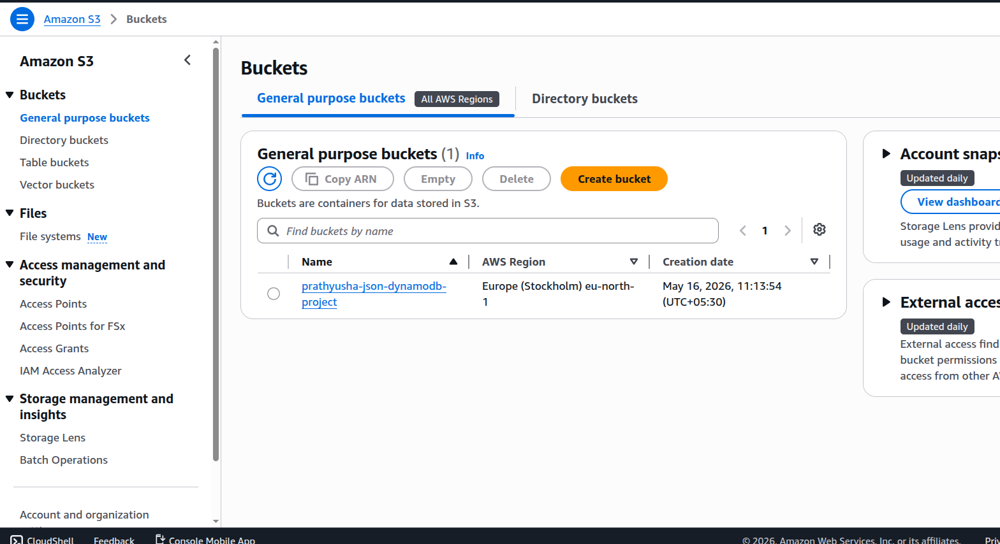

---

## Step 2: Created DynamoDB Table

Created a DynamoDB table to store the JSON records.

Table name:

```text
learnmore
```

Table schema:

```text
Partition key: PK
Sort key: SK
```

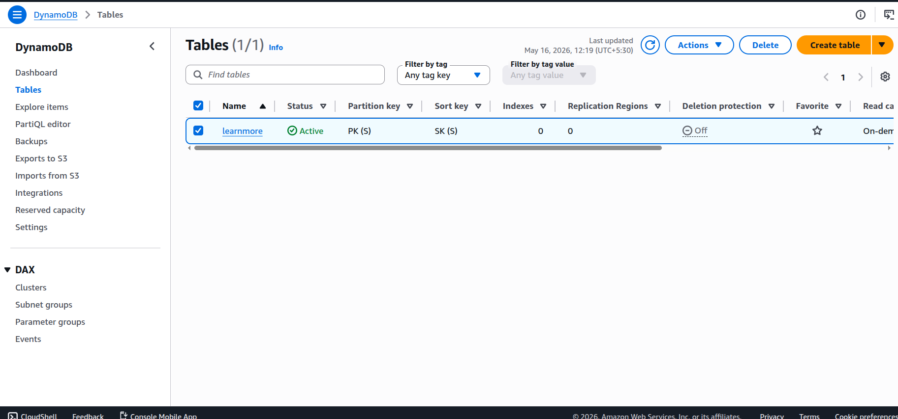

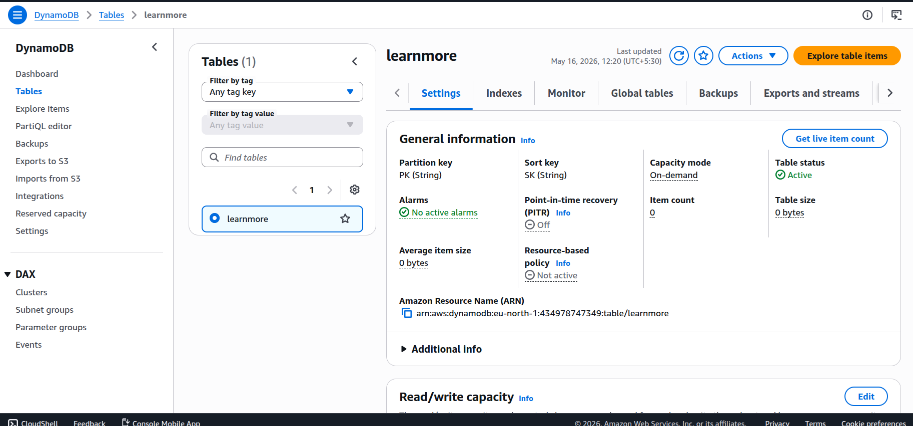

---

## Step 3: Created IAM Role for EC2

Created an IAM role and attached it to the EC2 instance.

Role name:

```text
EC2-S3-DynamoDB-Role
```

Permissions used:

```text
AmazonS3FullAccess
AmazonDynamoDBFullAccess
AmazonSNSFullAccess
```

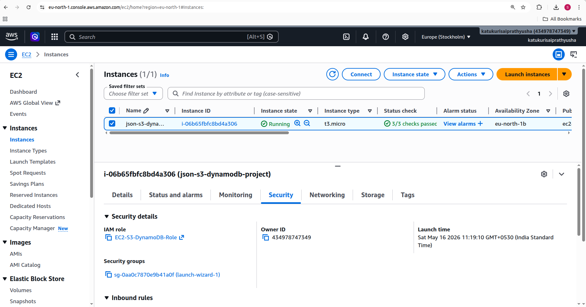

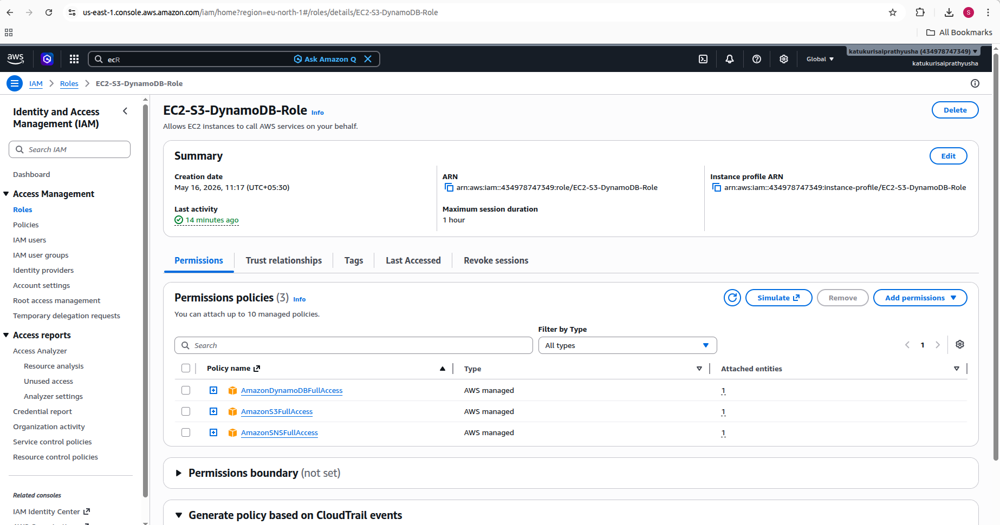

Note: For this learning project, AWS managed policies were used. In production, least-privilege IAM permissions should be used instead of full-access policies.

---

## Step 4: Launched EC2 Instance

Launched an Amazon Linux EC2 instance and used it as the automation server to run shell scripts.

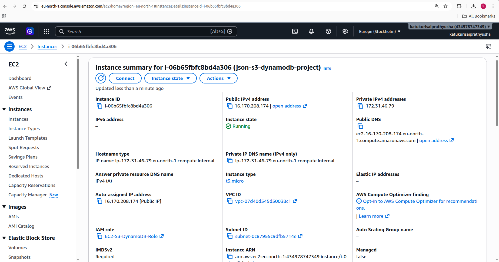

---

## Step 5: Installed Required Tools on EC2

Installed AWS CLI and jq on the EC2 instance.

Commands used:

```bash
sudo yum update -y
sudo yum install aws-cli jq -y
```

Verified AWS CLI:

```bash
aws --version
```

Verified jq:

```bash
jq --version
```

Verified IAM role access:

```bash
aws sts get-caller-identity
```

---

## Step 6: Generated JSON Files

Created a shell script to generate 100 JSON files automatically.

Script used:

```text
scripts/json_file_generator1.sh
```

Command used:

```bash
./json_file_generator1.sh
```

The script creates a folder named:

```text
generated_files
```

It generates files like:

```text
item_prd1001.json
item_prd1002.json
item_prd1003.json
...
item_prd1100.json
```

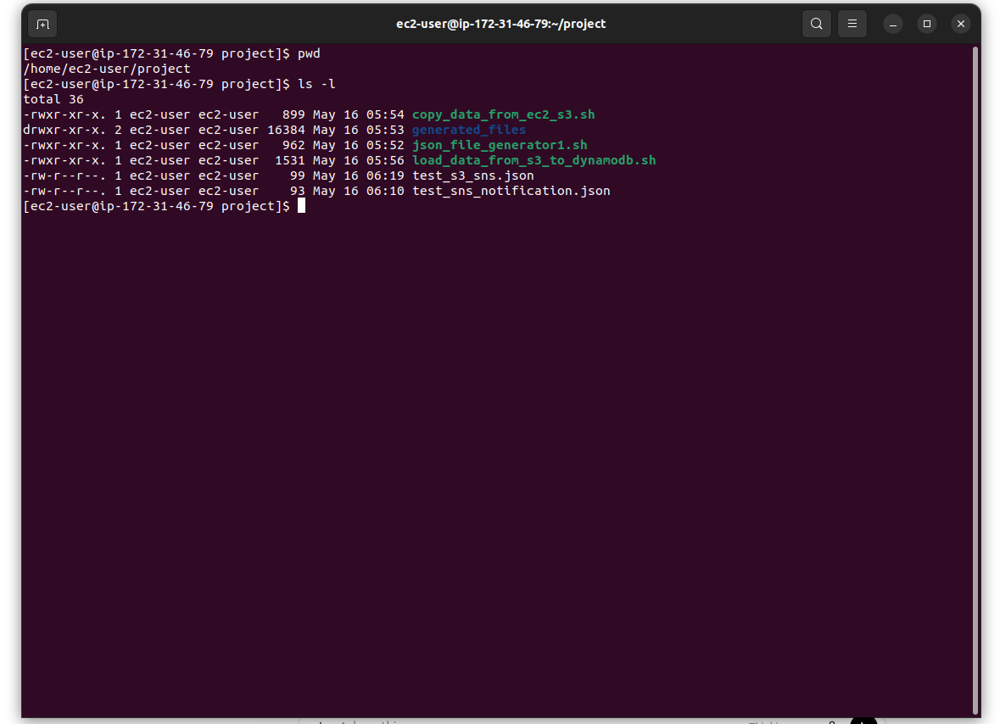

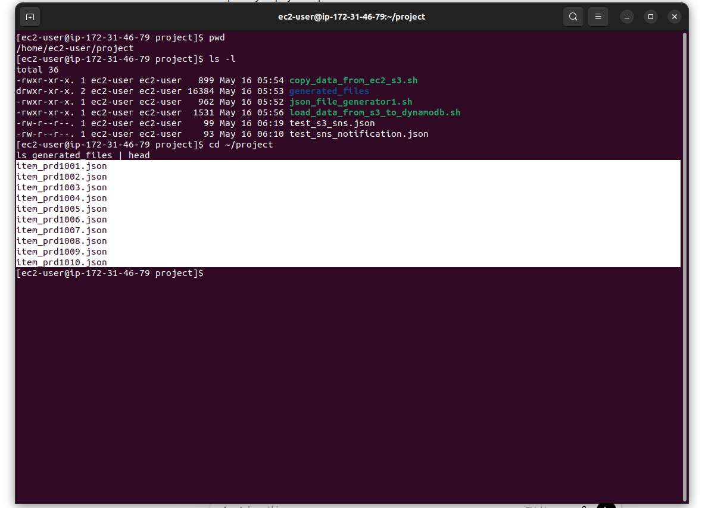

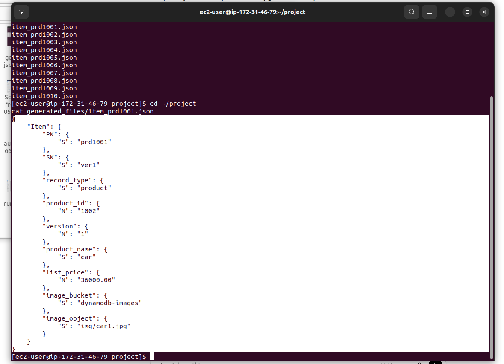

---

## Step 7: Uploaded JSON Files to S3

Created a shell script to upload generated JSON files from EC2 to S3.

Script used:

```text
scripts/copy_data_from_ec2_s3.sh
```

Command used:

```bash
./copy_data_from_ec2_s3.sh
```

Files were uploaded to:

```text
s3://prathyusha-json-dynamodb-project/json/
```

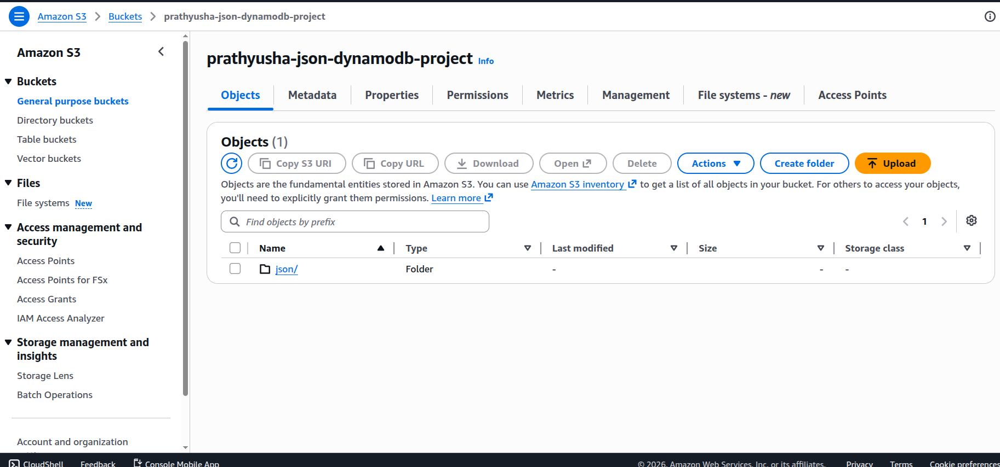

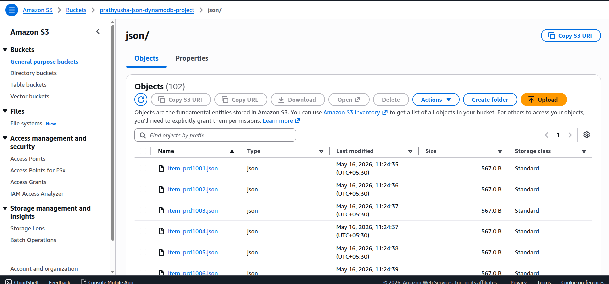

---

## Step 8: Loaded JSON Files from S3 to DynamoDB

Created a shell script to read JSON files from S3 and insert them into DynamoDB.

Script used:

```text
scripts/load_data_from_s3_to_dynamodb.sh
```

Command used:

```bash
./load_data_from_s3_to_dynamodb.sh
```

The script performs the following actions:

```text
1. Lists JSON files from the S3 bucket
2. Downloads each JSON file temporarily to EC2
3. Extracts the Item object using jq
4. Inserts the item into DynamoDB using aws dynamodb put-item
5. Deletes the temporary local file after processing
```

Verification command:

```bash
aws dynamodb scan \
  --table-name learnmore \
  --region eu-north-1 \
  --select COUNT
```

Expected result:

```text
Count: 100
```

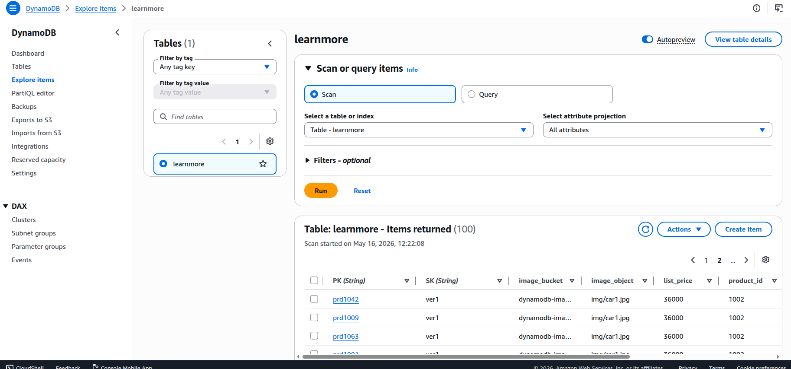

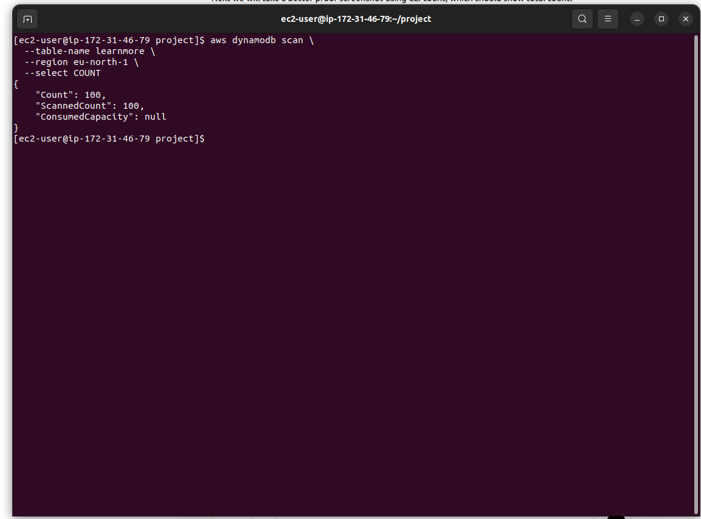

---

## Step 9: Configured SNS Topic

Created an SNS topic for notification delivery.

SNS topic name:

```text
Mytopic
```

SNS topic ARN:

```text
arn:aws:sns:eu-north-1:434978747349:Mytopic
```

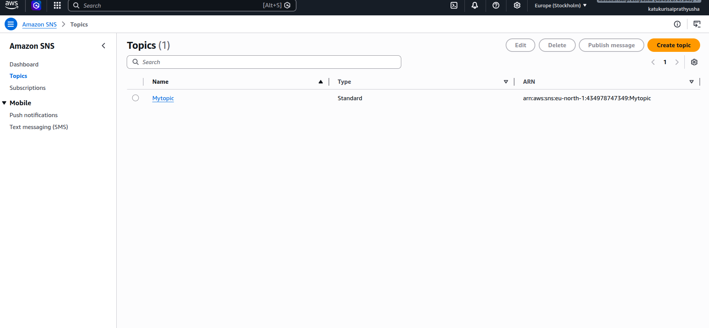

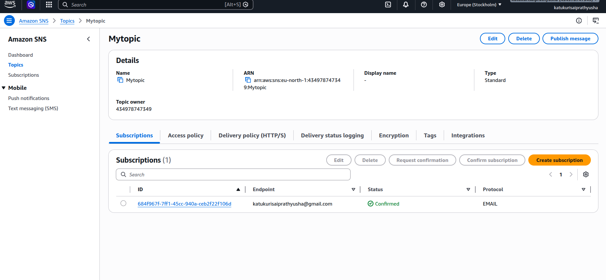

---

## Step 10: Configured S3 Event Notification

Configured an S3 event notification to trigger SNS whenever a new JSON file is uploaded to the `json/` folder.

Configuration used:

```text
Prefix: json/
Suffix: .json
Event type: ObjectCreated
Destination: SNS Topic
```

When a new JSON file is uploaded to S3, SNS sends an email notification.

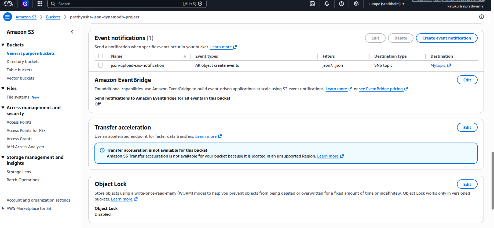

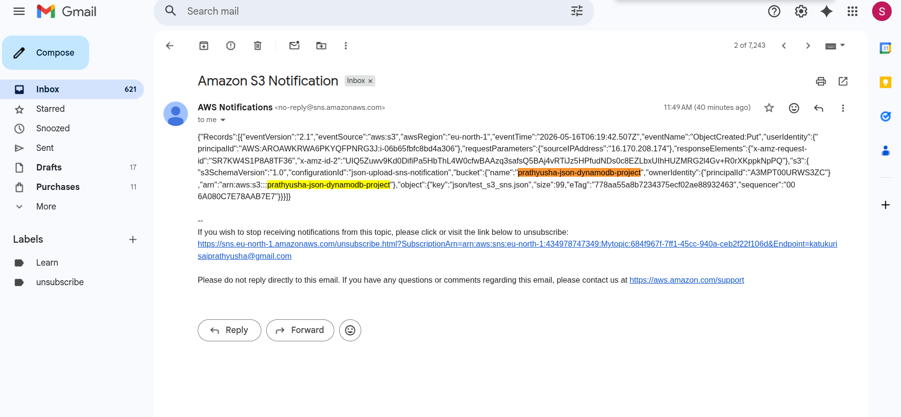

---

## Sample JSON Data

Each generated JSON file contains one product record.

Example:

```json
{
  "Item": {
    "PK": {
      "S": "prd1001"
    },
    "SK": {
      "S": "ver1"
    },
    "record_type": {
      "S": "product"
    },
    "product_id": {
      "N": "1002"
    },
    "version": {
      "N": "1"
    },
    "product_name": {
      "S": "car"
    },
    "list_price": {
      "N": "36000.00"
    },
    "image_bucket": {
      "S": "dynamodb-images"
    },
    "image_object": {
      "S": "img/car1.jpg"
    }
  }
}
```

In this project, only the `PK` value is generated dynamically.

Example:

```text
prd1001
prd1002
prd1003
...
prd1100
```

Other fields such as product name, price, product ID, and image details are static sample values.

---

## Troubleshooting

### Issue: SNS Publish Authorization Error

While testing direct SNS publish from EC2, the following error occurred:

```text
not authorized to perform: SNS:Publish
```

### Root Cause

The EC2 IAM role had permissions for S3 and DynamoDB, but it did not initially have permission to publish messages to SNS.

### Fix

Added SNS permission to the EC2 IAM role by attaching:

```text
AmazonSNSFullAccess
```

After adding this permission, the direct SNS publish command worked successfully.

Test command:

```bash
aws sns publish \
  --topic-arn arn:aws:sns:eu-north-1:434978747349:Mytopic \
  --message "Direct SNS test from EC2 after permission fix"
```

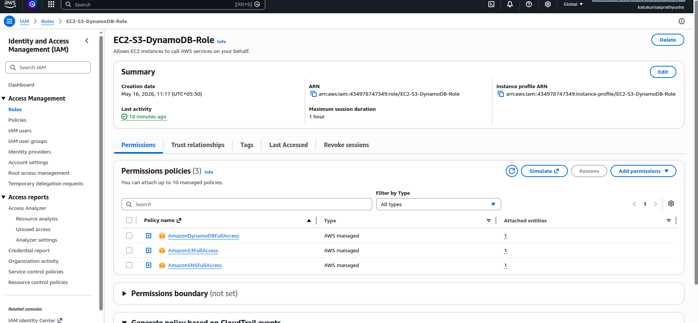

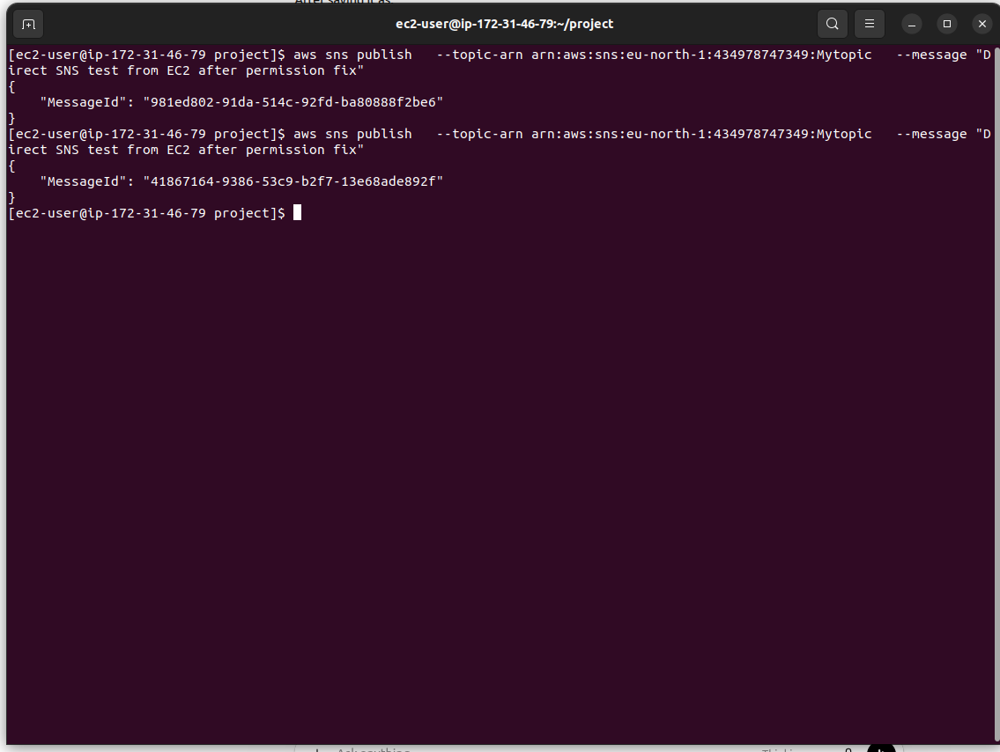

---

## Project Outcome

Successfully completed the following:

- Generated 100 JSON files using a shell script
- Uploaded JSON files from EC2 to S3
- Loaded JSON data from S3 into DynamoDB
- Verified 100 records in DynamoDB
- Configured SNS topic and email subscription
- Configured S3 event notification
- Triggered SNS email notification on S3 file upload
- Troubleshot and fixed SNS IAM permission issue

---

## Project Summary

This project demonstrates an automated AWS data workflow using EC2, S3, DynamoDB, IAM, SNS, AWS CLI, jq, and Shell scripting.

An EC2 instance is used to run shell scripts that generate multiple JSON files dynamically. The generated files are uploaded to an S3 bucket using AWS CLI. Another script reads the JSON files from S3, extracts item data using jq, and inserts the records into a DynamoDB table.

IAM roles are used to securely give EC2 access to S3, DynamoDB, and SNS without hardcoding access keys. S3 event notifications are configured with SNS so that whenever a new JSON file is uploaded to the S3 bucket, an email notification is triggered.

---

## Key Learnings

- Automated JSON file generation using Shell scripting
- Used AWS CLI to interact with S3, DynamoDB, and SNS
- Configured IAM role-based access for EC2
- Uploaded generated JSON files from EC2 to S3
- Loaded JSON data from S3 into DynamoDB
- Used jq to parse JSON data before inserting into DynamoDB
- Configured S3 event notifications with SNS
- Created and confirmed SNS email subscription
- Troubleshot IAM permission issues related to SNS publishing
- Understood the importance of least-privilege IAM permissions

---

## Cleanup

To avoid unnecessary AWS charges, the following resources should be deleted after completing the project documentation:

- EC2 instance
- S3 bucket objects and bucket
- DynamoDB table
- SNS topic and subscription
- IAM role if no longer needed
